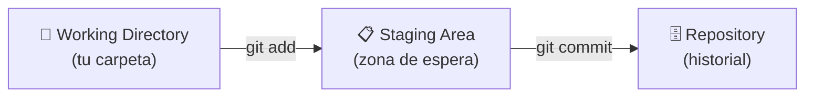

# El ciclo básico de Git

## Los tres estados de un archivo

Antes de aprender los comandos, necesitas entender el modelo mental de Git. Todo archivo en un repositorio puede estar en uno de estos tres estados:



1. **Working Directory**: los archivos tal como están en tu carpeta. Aquí editas y creas archivos.
2. **Staging Area** (o "índice"): una zona intermedia donde preparas exactamente qué va a incluir el próximo commit.
3. **Repository**: el historial permanente. Cada commit es una instantánea guardada para siempre.

---

## ¿Por qué existe la Staging Area?

Puede parecer un paso extra innecesario, pero es muy útil: te permite hacer un commit con solo una parte de tus cambios. Por ejemplo, si modificaste tres archivos pero solo quieres guardar dos de ellos en este commit, añades solo esos dos al staging y haces el commit.

---

## El flujo en la práctica

### 1. Modificas o creas un archivo

Simplemente edita o crea el archivo como siempre. Git lo detecta automáticamente.

### 2. Revisas el estado

```bash
git status
```

Te muestra qué archivos han cambiado y en qué estado están.

### 3. Añades al staging

```bash
git add nombre-del-archivo.md
```

O para añadir todos los cambios de golpe:

```bash
git add .
```

### 4. Haces el commit

```bash
git commit -m "docs: agregar notas sobre el ciclo basico de git"
```

El mensaje entre comillas describe qué hiciste. Esto es muy importante — lo veremos en detalle en el tema 04.

### 5. Consultas el historial

```bash
git log
```

Muestra la lista de commits con su autor, fecha y mensaje.

---

## Resumen del ciclo

Editar → `git add` → `git commit` → repetir.

Es un bucle que harás cientos de veces. Con el tiempo se vuelve completamente automático.
