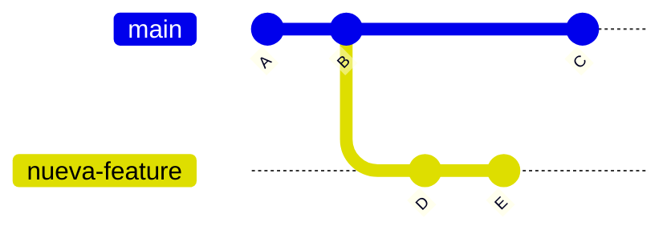

# Ramas

## ¿Qué es una rama?

Imagina que tu proyecto es una línea de tiempo. Cada commit es un punto en esa línea. Una **rama** es simplemente un nombre que apunta a uno de esos puntos y avanza junto a él.

La rama por defecto se llama `main` (o `master` en proyectos más antiguos). Sobre ella vive lo que consideramos el estado "oficial" del proyecto.

---

## ¿Para qué sirven las ramas?

Las ramas permiten **trabajar en paralelo** sin afectar al trabajo principal. Casos de uso habituales:

- Desarrollar una nueva funcionalidad sin romper lo que ya funciona
- Probar un experimento que puede que no llegue a nada
- Trabajar en equipo: cada persona en su propia rama
- Revisar código antes de incorporarlo al proyecto principal

---

## El flujo habitual con ramas



1. Partes desde `main` y creas una rama `nueva-feature`
2. Haces commits D y E en esa rama sin tocar `main`
3. Mientras tanto, `main` puede seguir avanzando con su propio commit C
4. Cuando estás satisfecho, lo incorporas a `main` (eso es un merge, lo veremos en el tema siguiente)

---

## Crear y cambiar de rama

```bash
# Crear una nueva rama y cambiarte a ella (la forma moderna)
git switch -c nombre-de-la-rama

# Ver en qué rama estás
git branch

# Ver todas las ramas, incluyendo las remotas
git branch -a
```

---

## ¿En qué rama estoy?

Siempre puedes saberlo con:

```bash
git branch
```

La rama activa aparece marcada con un `*` y en un color distinto.

También aparece en el prompt si usas herramientas como Git Bash o la integración de VS Code.

---

## Nombres de ramas: buenas prácticas

Usa nombres descriptivos y en minúsculas con guiones:

```
✅ feat/formulario-contacto
✅ fix/error-calculo-iva
✅ docs/actualizar-readme

❌ rama1
❌ prueba
❌ micosa
```

Un buen nombre de rama cuenta qué se está haciendo en ella.

---

## Guardar trabajo a medias: git stash

A veces necesitas cambiar de rama pero tienes cambios a medio hacer que todavía no quieres commitear. `git stash` guarda esos cambios temporalmente para que puedas recuperarlos después.

```
Working directory con cambios sin commit
        ↓ git stash
Cambios guardados en el stash (pila temporal)
        ↓ (cambias de rama, arreglas lo que necesitas)
        ↓ git stash pop
Los cambios vuelven al working directory
```

Es como una pausa: apartas el trabajo sin perderlo, haces lo que necesites en otra rama y luego lo retomas.
