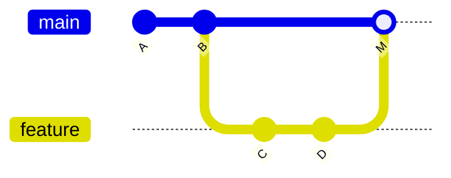

# Merge y conflictos

## ¿Qué es un merge?

Un **merge** es la operación de incorporar los commits de una rama dentro de otra. Es el momento en que el trabajo paralelo se une.



El commit `M` combina los cambios de `main` y de `feature`.

---

## Cómo hacer un merge

Para incorporar los cambios de `feature` dentro de `main`:

```bash
# Posiciónate en la rama que quiere recibir los cambios
git switch main

# Fusiona la otra rama en la actual
git merge nombre-de-la-rama
```

---

## ¿Qué es un conflicto?

Un conflicto ocurre cuando dos ramas han modificado **el mismo fragmento del mismo archivo** de formas diferentes. Git no sabe qué versión conservar, así que te lo pide a ti.

No es un error. Es Git diciéndote: "aquí hay dos versiones y necesito que decidas cuál queda".

---

## Cómo se ve un conflicto

Git modifica el archivo con marcadores especiales:

```
<<<<<<< HEAD
Esta es la versión de la rama actual (main)
=======
Esta es la versión de la rama que estás fusionando
>>>>>>> feature/nueva-seccion
```

Tu trabajo es:
1. Leer las dos versiones
2. Decidir qué queda (puede ser una, la otra, o una combinación)
3. Eliminar **todos** los marcadores (`<<<<<<<`, `=======`, `>>>>>>>`)
4. Guardar el archivo
5. Hacer `git add` y `git commit`

---

## Cómo resolver un conflicto paso a paso

```bash
# 1. Intentas el merge
git merge nombre-de-la-rama

# 2. Git avisa del conflicto — comprueba qué archivos están en conflicto
git status

# 3. Abres el archivo, editas para resolver, eliminas marcadores
# (lo haces en tu editor)

# 4. Marcas el archivo como resuelto
git add archivo-con-conflicto.md

# 5. Completas el merge
git commit
```

---

## Consejo: no entres en pánico

Los conflictos parecen intimidantes la primera vez. Pero son simplemente texto. Lee las dos versiones, decide qué tiene sentido, borra los marcadores y listo. Con práctica se resuelven en segundos.

---

## Eliminar ramas fusionadas

Una vez que has hecho el merge, la rama ya cumplió su función. Es buena práctica eliminarla para mantener el repositorio limpio:

```bash
git branch -d nombre-de-la-rama
```
