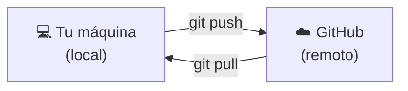

# Conectar con GitHub

## Git vs GitHub: el repositorio local y el remoto

Hasta ahora todo lo que has hecho vive en tu máquina. Un **repositorio remoto** es una copia del repositorio alojada en un servidor (como GitHub), accesible desde cualquier lugar.



---

## Crear un repositorio en GitHub

1. Ve a [github.com](https://github.com) y accede a tu cuenta
2. Haz clic en el botón **New** (o el icono `+` → `New repository`)
3. Dale un nombre (por ejemplo: `practica-git`)
4. **No** inicialices con README ni .gitignore (ya los tienes en local)
5. Haz clic en **Create repository**

GitHub te mostrará los comandos para conectarlo con tu repositorio local.

---

## Conectar el repositorio local con el remoto

```bash
# Añadir el remoto (origin es el nombre convencional)
git remote add origin https://github.com/tu-usuario/practica-git.git

# Verificar que se añadió correctamente
git remote -v
```

---

## Autenticación: cómo sabe GitHub que eres tú

La primera vez que haces `push`, GitHub necesita verificar que tienes permiso para escribir en ese repositorio.

**En Windows con Git instalado recientemente**, lo más habitual es que se abra una ventana del navegador para iniciar sesión en tu cuenta de GitHub. Esto lo gestiona automáticamente el **Git Credential Manager**, que viene incluido con Git para Windows. Si ocurre, sigue las instrucciones en pantalla y el push se completará solo.

Si ese flujo no funciona, o usas otro sistema operativo, las dos opciones más comunes son:

**Token de acceso personal (PAT)**
GitHub usa tokens como contraseña de aplicación. Cuando Git te pida contraseña por la terminal, introduces el token en lugar de tu contraseña habitual de GitHub.

Pasos para crear uno:
1. GitHub → tu avatar (arriba a la derecha) → **Settings**
2. **Developer settings** → **Personal access tokens** → **Tokens (classic)**
3. **Generate new token** → marca el permiso `repo` → genera y copia el token
4. Cuando Git pida contraseña, pega el token

**Clave SSH** *(alternativa más cómoda a largo plazo)*
Generas un par de claves en tu máquina (`ssh-keygen`) y añades la clave pública a GitHub → Settings → SSH and GPG keys. A partir de ahí no necesitas autenticarte manualmente en cada push. Si optas por SSH, cambia la URL del remoto para que empiece por `git@github.com:` en lugar de `https://`.

> Para este curso, el Git Credential Manager suele ser suficiente. Si te quedas bloqueado en el primer push, revisa los pasos del PAT — es la solución más rápida.

---

## Enviar tu historial a GitHub: push

```bash
# Primera vez: publicas la rama y estableces el seguimiento
git push -u origin main

# Las siguientes veces, desde esa rama:
git push
```

---

## Traer cambios del remoto: pull

Cuando hay cambios en GitHub que no tienes en local (por ejemplo, alguien más hizo commits, o editaste desde la web):

```bash
git pull
```

---

## Clonar un repositorio existente

Si quieres descargar un repositorio de GitHub a tu máquina:

```bash
git clone https://github.com/usuario/nombre-del-repo.git
```

Esto descarga el repositorio completo (con todo su historial) y ya configura automáticamente el remoto.

---

## El flujo diario con remoto

```
git pull              → traer cambios recientes
(trabajas y haces commits locales)
git push              → enviar tus commits al remoto
```

Es buena práctica hacer `git pull` antes de empezar a trabajar, para asegurarte de que partes de la versión más actualizada.
