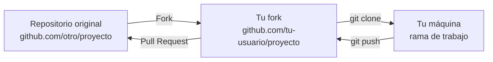

# Fork y Pull Request

## El flujo de colaboración en GitHub

Git te permite trabajar en ramas. GitHub añade encima de eso un flujo de colaboración basado en dos conceptos clave: el **fork** y el **pull request**.

---

## ¿Qué es un fork?

Un **fork** es una copia de un repositorio en tu propia cuenta de GitHub. Puedes hacer cambios en esa copia sin afectar al repositorio original.

Es el mecanismo estándar para contribuir a proyectos de otras personas u organizaciones.



---

## ¿Qué es un Pull Request (PR)?

Un **Pull Request** es una propuesta de cambio. Es tu forma de decirle al propietario del repositorio original: "He hecho estos cambios en mi fork, ¿los incorporas al repositorio principal?"

El proceso implica:
1. Hacer fork del repositorio
2. Clonar tu fork en local
3. Crear una rama con tus cambios
4. Hacer push de esa rama a tu fork
5. Abrir un Pull Request desde GitHub

---

## El flujo completo paso a paso

### En GitHub:
1. Ve al repositorio que quieres contribuir
2. Haz clic en **Fork** (arriba a la derecha)
3. GitHub crea una copia en tu cuenta

### En tu máquina:
```bash
# Clona tu fork (no el original)
git clone https://github.com/TU-USUARIO/nombre-repo.git
cd nombre-repo

# Crea una rama para tus cambios
git switch -c feat/mi-contribucion

# Haz los cambios, add y commit
git add .
git commit -m "feat: descripcion de mi contribucion"

# Envía la rama a tu fork
git push origin feat/mi-contribucion
```

### De nuevo en GitHub:
1. GitHub detecta la rama subida y te sugiere abrir un PR
2. Haz clic en **Compare & pull request**
3. Escribe una descripción clara de qué hiciste y por qué
4. Haz clic en **Create pull request**

---

## ¿Para qué sirven los PR dentro de tu propio equipo?

Los PR no son solo para proyectos externos. En equipos, es buena práctica que nadie haga push directo a `main`. En su lugar, cada persona trabaja en una rama y abre un PR para que otra persona revise el código antes de fusionarlo.

Esto permite:
- Revisar cambios antes de incorporarlos
- Dejar comentarios y sugerencias
- Mantener un historial claro de qué se aprobó y por qué

---

## Mantener tu fork actualizado

Con el tiempo, el repositorio original avanza. Para mantener tu fork al día:

```bash
# Añadir el repo original como remoto "upstream"
git remote add upstream https://github.com/otro/nombre-repo.git

# Traer los cambios del original
git fetch upstream
git merge upstream/main
```

---

## Ramas divergentes: el bloqueo más común

Uno de los errores más habituales aparece cuando tu rama local y la rama remota han avanzado por separado. Git suele avisar con mensajes como:

```bash
hint: You have divergent branches and need to specify how to reconcile them.
```

O también:

```bash
! [rejected] main -> main (non-fast-forward)
```

Esto significa que tu rama local no está "por delante" ni "por detrás" sin más: ambas tienen commits distintos.

### Cuándo pasa

- Hiciste commits en local y además hubo cambios nuevos en GitHub
- Editaste algo desde la web y luego seguiste trabajando en tu máquina
- Varias personas empujaron cambios sobre la misma rama

### Qué hacer

Primero trae los cambios remotos y luego integra ambos historiales:

```bash
git pull --rebase
```

Si prefieres el enfoque más explícito:

```bash
git fetch origin
git rebase origin/main
```

Si hay conflictos, resuélvelos, haz `git add` de los archivos corregidos y sigue con:

```bash
git rebase --continue
```

Cuando termine, ya podrás hacer `git push`.

### Regla práctica

Si trabajas tú sola o solo y quieres un historial más limpio, `pull --rebase` suele ser la mejor opción.

Si todavía no entiendes bien rebase, no pasa nada: lo importante es que entiendas el problema. Tu rama local y la remota se separaron, y Git te obliga a decidir cómo volver a unirlas.
